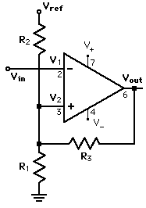
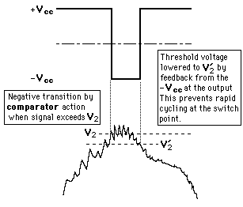
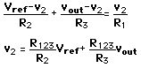
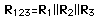
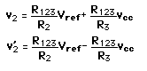

# Inverting-Schmitt-trigger-calculator-py






# Schmitt Trigger Resistor Calculator

This tool helps calculate resistor values (R1, R2, R3) for a non-inverting Schmitt Trigger given:

- Desired upper trigger voltage (V_UT)
- Hysteresis voltage (difference between V_UT and V_LT)
- V_ref and output high voltage (typically 5V)
- Assumed parallel resistance R123

## 📐 Formulae

- R3 = R123 ÷ ((V_UT - V_LT) ÷ V_CC)  
- R2 = R123 ÷ (V_LT ÷ V_REF)  
- R1 = 1 ÷ ( (1 ÷ R123) - (1 ÷ R2) - (1 ÷ R3) )

---

## 🧮 Python Calculator

```python
def schmitt_trigger_resistors(V_UT, hysteresis, V_ref=5.0, Vcc=5.0, R123=10000):
    V_LT = V_UT - hysteresis

    # Calculate R3 and R2
    R3 = R123 / ((V_UT - V_LT) / Vcc)
    R2 = R123 / (V_LT / V_ref)

    # Calculate R1 using parallel resistance formula
    inv_R123 = 1 / R123
    inv_R2 = 1 / R2
    inv_R3 = 1 / R3
    inv_R1 = inv_R123 - inv_R2 - inv_R3
    R1 = 1 / inv_R1 if inv_R1 != 0 else float('inf')

    return round(R1, 2), round(R2, 2), round(R3, 2)

# Example usage
triggers = [
    {"V_UT": 3.25, "hysteresis": 0.2},
    {"V_UT": 1.8, "hysteresis": 0.2},
]

for t in triggers:
    R1, R2, R3 = schmitt_trigger_resistors(t["V_UT"], t["hysteresis"])
    print(f"For V_UT={t['V_UT']}V and H={t['hysteresis']}V:")
    print(f"  R1 = {R1} Ω, R2 = {R2} Ω, R3 = {R3} Ω\\n")


## 🧪 Output Example

```
For V_UT=3.25V and H=0.2V:
  R1 = 28571.43 Ω, R2 = 16393.44 Ω, R3 = 250000.0 Ω

  ```

For V_UT=1.8V and H=0.2V:
  R1 = 15625.0 Ω, R2 = 31250.0 Ω, R3 = 250000.0 Ω
```
