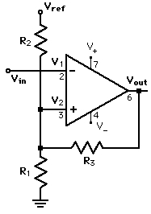
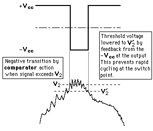
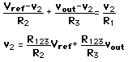
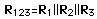
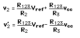

# Inverting-Schmitt-trigger-calculator-py






# Schmitt Trigger Resistor Calculator

A web page and a Python CLI for the inverting Schmitt trigger from HyperPhysics (Vref → R2 → node A → R1 → GND, R3 feedback from Vout to node A, Vin on the inverting input). It works in two directions:

| Mode | You enter | You get |
|------|-----------|---------|
| **Design** | Voh, Vol, V_UT, V_LT, Vref (and R123) | R1, R2, R3 |
| **Analyze** | R1, R2, R3, Voh, Vol, Vref | V_UT, V_LT, V_hys |

Both modes also show the **nearest standard resistor value** (E12, E24 or E96), its error, and the thresholds you actually get when you build the circuit with those standard values.

## 🌐 Web page

`index.html` is a single self-contained file with no dependencies.

- Open it locally in any browser, or
- Publish it with GitHub Pages: push to a repo, then **Settings → Pages → Deploy from a branch → `main` / root**. The page appears at `https://<user>.github.io/<repo>/`.

## 📐 Formulae

With R123 = R1 ‖ R2 ‖ R3 (1/R123 = 1/R1 + 1/R2 + 1/R3):

**Analyze** (resistors → thresholds)

- V_UT = R123 · (Vref/R2 + Voh/R3)
- V_LT = R123 · (Vref/R2 + Vol/R3)
- V_hys = V_UT − V_LT = R123 · (Voh − Vol) / R3

**Design** (thresholds → resistors)

- R3 = R123 · (Voh − Vol) / (V_UT − V_LT)
- R2 = R123 · Vref · (Voh − Vol) / (Voh · V_LT − Vol · V_UT)
- R1 = 1 / (1/R123 − 1/R2 − 1/R3)

**Special cases**

- Dual supply, ±Vcc output (as in the figure): R3 = 2·R123·Vcc / (V_UT − V_LT) and R2 = 2·R123·Vref / (V_UT + V_LT)
- Single supply, Vol = 0: R3 = R123·Voh / (V_UT − V_LT) and R2 = R123·Vref / V_LT

> Earlier versions of this README used `R3 = R123 / ((V_UT − V_LT) / Vcc)` and `R2 = R123 / (V_LT / Vref)`. Those are only correct for a single supply (Vol = 0). With a negative low output (for example −Vcc) they give wrong values, so use the general formulas above.

R123 is a free design choice. It must be smaller than R1, R2 and R3. If R1 comes out negative or infinite, choose a smaller R123.

## 🖥️ CLI

Python 3.8+, no dependencies.

```bash
# Design: thresholds -> resistors
python schmitt_trigger.py design --voh 5 --vol 0 --vut 1.8 --vlt 1.6 --vref 5 --r123 10k --series E24

# Analyze: resistors -> thresholds
python schmitt_trigger.py analyze --r1 15k --r2 30k --r3 240k --voh 5 --vol 0 --vref 5

# Interactive prompts
python schmitt_trigger.py
```

Resistor suffixes: `k` (kilo), `M` (mega), `G` (giga). Choose the series with `--series E12|E24|E96` (default E24).

## 🧪 Output Example 1: design

```
            Exact     Nearest E24    Error
R1       15.62 kΩ           16 kΩ    2.40%
R2       31.25 kΩ           30 kΩ   -4.00%
R3         250 kΩ          240 kΩ   -4.00%

          Exact R     Std R
V_UT       1.800V    1.875V
V_LT       1.600V    1.667V
V_hys      0.200V    0.208V
```

With the exact values the thresholds hit the targets. The Std R column shows how far they drift when you round to E24.

## 🧪 Output Example 2: analyze

```
            Exact     Nearest E24    Error
R1          15 kΩ           15 kΩ    0.00%
R2          30 kΩ           30 kΩ    0.00%
R3         240 kΩ          240 kΩ    0.00%

          Exact R     Std R
V_UT       1.800V    1.800V
V_LT       1.600V    1.600V
V_hys      0.200V    0.200V
```

## 🧮 Use as a Python module

```python
from schmitt_trigger import design, analyze, nearest

# Single supply: output swings 0 V .. 5 V
for v_ut, h in [(3.25, 0.2), (1.8, 0.2)]:
    R1, R2, R3 = design(voh=5, vol=0, vut=v_ut, vlt=v_ut - h, vref=5, r123=10e3)
    print(f"For V_UT={v_ut}V and H={h}V:")
    print(f"  R1 = {R1:.2f} Ω, R2 = {R2:.2f} Ω, R3 = {R3:.2f} Ω")
    print("  nearest E24:", [nearest(r, "E24") for r in (R1, R2, R3)])

# Check a set of resistor values: returns (V_UT, V_LT, V_hys)
print(analyze(15e3, 30e3, 240e3, voh=5, vol=0, vref=5))
```

Output:

```
For V_UT=3.25V and H=0.2V:
  R1 = 28571.43 Ω, R2 = 16393.44 Ω, R3 = 250000.00 Ω
  nearest E24: [30000.0, 16000.0, 240000.0]
For V_UT=1.8V and H=0.2V:
  R1 = 15625.00 Ω, R2 = 31250.00 Ω, R3 = 250000.00 Ω
  nearest E24: [16000.0, 30000.0, 240000.0]
```

## ⚠️ Notes

- Keep V_UT and V_LT inside the op-amp's input common-mode range.
- Voh and Vol are the actual output levels. For an op-amp that does not swing rail to rail, enter the measured levels instead of the supply voltages.
- Standard-value rounding shifts the thresholds, so always read the Std R column before building.

## 🔗 Useful Links

- 🌐 Original reference: [HyperPhysics - Schmitt Trigger](http://hyperphysics.phy-astr.gsu.edu/hbase/Electronic/schmitt.html#c2)
- 🐍 Online Python compiler: [Programiz](https://www.programiz.com/python-programming/online-compiler/)
